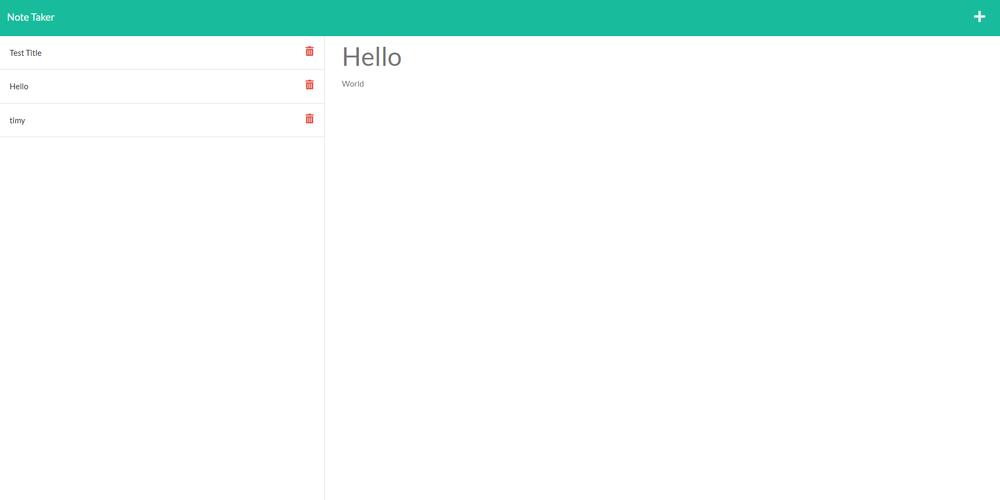

# Note Taker

## Desription

Note Taker is a site that allows you to create notes and send them to be sent on a server where they are stored remotely. It allows for the notes to be called from that server and to be deleted .
This project was used to demonstrate the ability to use get and push methods to allow a server to access and delete data when directed from a website.

During this project I learned how to use express.js more thuroughly and was able to better understand the functionality behind the get and push methods.

## Table of Contents

- [Installation](#installation)
- [Usage](#usage)
- [Credits](#credits)
- [Tests](#tests)
- [License](#license)

## Installation

To install the project copy the files onto your computer. Open an terminal with the path set to start in the Note-Taker folder. Type NPM Install. After the instalation has occured type "node server.js" . This will start the server.

## Usage

Type notes into the website and they will be saved to the server.

## Credits

Help given by BCS Tutoring Services.

## Questions

Please contact me with any questions at Ralakash
or email me at shawnkaralash@gmail.com

## License

This project is licensed under MIT license
